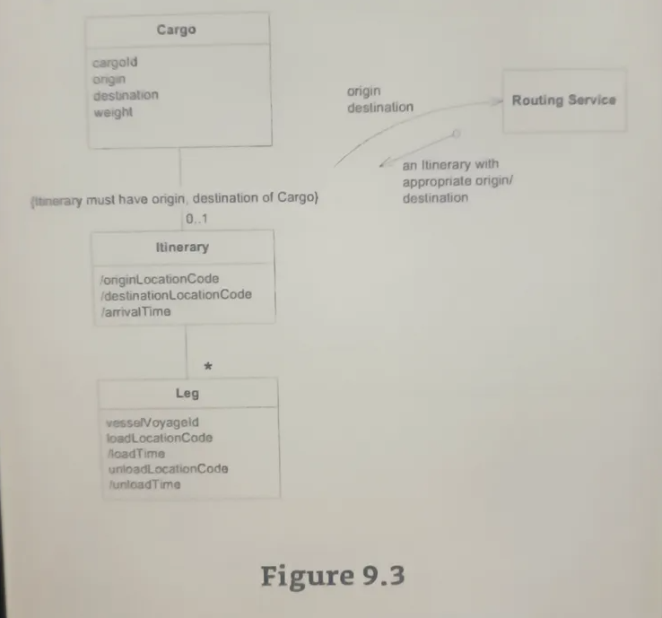
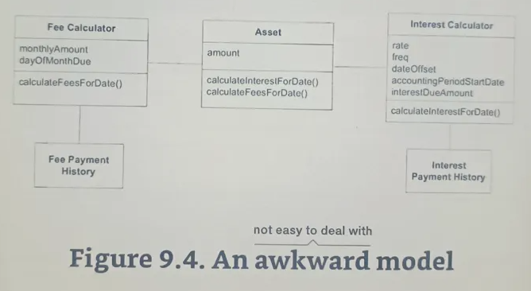
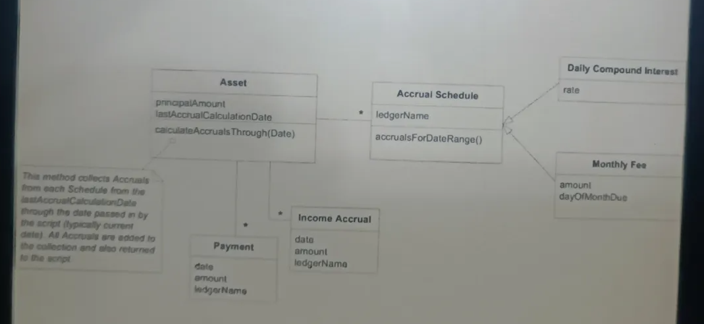
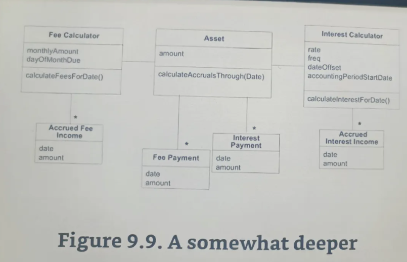

# Figure 9.3



```csharp
public class Cargo
{
    public string CargoId { get; set; }
    public string Origin { get; set; }
    public string Destination { get; set; }
    public double Weight { get; set; }
}

public class RoutingService
{
    public Itinerary GetItinerary(string origin, string destination)
    {
        // Implementation to generate an itinerary based on origin and destination
        return new Itinerary();
    }
}

public class Itinerary
{
    public string OriginLocationCode { get; set; }
    public string DestinationLocationCode { get; set; }
    public DateTime ArrivalTime { get; set; }
    public List<Leg> Legs { get; set; } = new List<Leg>();
}

public class Leg
{
    public string VesselVoyageId { get; set; }
    public string LoadLocationCode { get; set; }
    public DateTime LoadTime { get; set; }
    public string UnloadLocationCode { get; set; }
    public DateTime UnloadTime { get; set; }
}
```

# Figure 9.4 - An awkward model



```csharp
public class FeeCalculator
{
    public decimal MonthlyAmount { get; set; }
    public int DayOfMonthDue { get; set; }

    public decimal CalculateFeesForDate(DateTime date)
    {
        // Implementation to calculate fees for a given date
        return 0; // Placeholder return
    }
}

public class Asset
{
    public decimal Amount { get; set; }

    public decimal CalculateInterestForDate(DateTime date)
    {
        // Implementation to calculate interest for a given date
        return 0; // Placeholder return
    }

    public decimal CalculateFeesForDate(DateTime date)
    {
        // Implementation to calculate fees for a given date
        return 0; // Placeholder return
    }
}

public class InterestCalculator
{
    public decimal Rate { get; set; }
    public int Frequency { get; set; }
    public int DayOffset { get; set; }
    public DateTime AccountingPeriodStartDate { get; set; }
    public decimal InterestDueAmount { get; set; }

    public decimal CalculateInterestForDate(DateTime date)
    {
        // Implementation to calculate interest for a given date
        return 0; // Placeholder return
    }
}

public class FeePaymentHistory
{
    // Properties and methods for fee payment history
}

public class InterestPaymentHistory
{
    // Properties and methods for interest payment history
}
```

# Figure?




```csharp
public class Asset
{
    public decimal PrincipalAmount { get; set; }
    public DateTime LastAccrualCalculationDate { get; set; }
    public List<AccrualSchedule> AccrualSchedules { get; set; } = new List<AccrualSchedule>();
    public List<Payment> Payments { get; set; } = new List<Payment>();

    public List<IncomeAccrual> CalculateAccrualsThrough(DateTime date)
    {
        // This method collects Accruals from each Schedule from the
        // lastAccrualCalculationDate through the date passed in by
        // the script (typically current date). All Accruals are added to
        // the collection and also returned to the script.
        List<IncomeAccrual> accruals = new List<IncomeAccrual>();
        foreach (var schedule in AccrualSchedules)
        {
            accruals.AddRange(schedule.AccrualsForDateRange(LastAccrualCalculationDate, date));
        }
        LastAccrualCalculationDate = date;
        return accruals;
    }
}

public class AccrualSchedule
{
    public string LedgerName { get; set; }
    public DailyCompoundInterest DailyCompoundInterest { get; set; }
    public MonthlyFee MonthlyFee { get; set; }

    public List<IncomeAccrual> AccrualsForDateRange(DateTime startDate, DateTime endDate)
    {
        // Implementation to calculate accruals for the given date range
        return new List<IncomeAccrual>();
    }
}

public class DailyCompoundInterest
{
    public decimal Rate { get; set; }
}

public class MonthlyFee
{
    public decimal Amount { get; set; }
    public int DayOfMonthDue { get; set; }
}

public class Payment
{
    public DateTime Date { get; set; }
    public decimal Amount { get; set; }
    public string LedgerName { get; set; }
}

public class IncomeAccrual
{
    public DateTime Date { get; set; }
    public decimal Amount { get; set; }
    public string LedgerName { get; set; }
}
```
# Figure 9.9 - A somewhat deeper model



```csharp
public class FeeCalculator
{
    public decimal MonthlyAmount { get; set; }
    public int DayOfMonthDue { get; set; }

    public decimal CalculateFeesForDate(DateTime date)
    {
        // Implementation to calculate fees for a given date
        return 0; // Placeholder return
    }
}

public class Asset
{
    public decimal Amount { get; set; }

    public void CalculateAccrualsThrough(DateTime date)
    {
        // Implementation to calculate accruals through a given date
    }
}

public class InterestCalculator
{
    public decimal Rate { get; set; }
    public int Freq { get; set; }
    public int DateOffset { get; set; }
    public DateTime AccountingPeriodStartDate { get; set; }

    public decimal CalculateInterestForDate(DateTime date)
    {
        // Implementation to calculate interest for a given date
        return 0; // Placeholder return
    }
}

public class AccruedFeeIncome
{
    public DateTime Date { get; set; }
    public decimal Amount { get; set; }
}

public class FeePayment
{
    public DateTime Date { get; set; }
    public decimal Amount { get; set; }
}

public class InterestPayment
{
    public DateTime Date { get; set; }
    public decimal Amount { get; set; }
}

public class AccruedInterestIncome
{
    public DateTime Date { get; set; }
    public decimal Amount { get; set; }
}
```